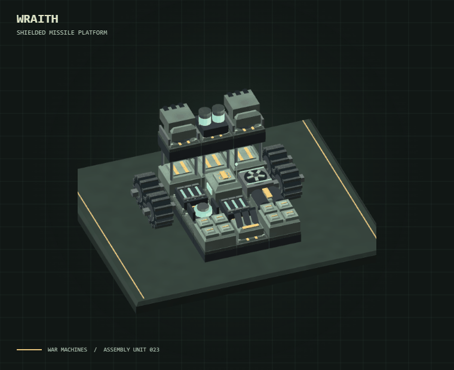

# WAR MACHINES — THE FOUNDRY



[🔊 Hear the Robotic City V2 theme](https://warmachine.live/audio/general.ogg)

A modular engineering battle game for desktop and mobile browsers. Build a machine, set its doctrine, scout a defender and design a counter. Battles run automatically. The workshop and ordinary machine links work on a static host; **public bounties use the bundled Worker/D1 backend and direct Tempo escrow**.

No hosted AI calls, external fonts, asset CDNs or analytics. Every machine, texture and arena is generated locally. The public release uses direct Tempo mainnet escrow calls for bounties. V5 intentionally uses one trusted settlement signer for this small trial, and native MPP briefly forwards the payer's pathUSD through a bounded relayer before the matching escrow call.

## Hosting and cost

The public Worker/D1 deployment runs at [warmachine.live](https://warmachine.live). It verifies exact Tempo escrow receipts and records signed results. During native MPP forwarding, the configured relayer temporarily controls the payment until it forwards the matching V5 call; the Worker does not hold player payout reserves. Read [docs/HOSTING.md](docs/HOSTING.md) before operating another host.

Automatic settlement deployment, secret bindings, pause controls and recovery are documented in [docs/AUTOMATIC-SETTLEMENT.md](docs/AUTOMATIC-SETTLEMENT.md). Rendering measurements are in [docs/RENDER-PERFORMANCE.md](docs/RENDER-PERFORMANCE.md).

## Play locally — complete game

Install/use Node 22.21.1 or a compatible newer runtime with built-in SQLite and worker threads, then install the pinned dependencies.

```sh
npm ci
node server.mjs
```

Open http://127.0.0.1:8770/ or double-click `play-local.bat`. Keep the terminal open. SQLite persists in `var/war-machines.sqlite`; closing a browser does not discard official results. Back up the database before upgrades. The default listener is loopback only. `PORT`, `HOST`, and `DATABASE_PATH` are optional server configuration variables, not payment settings.

For the static sandbox only: `python serve.py --open`, then open http://127.0.0.1:8765/. A static upload needs only `dist/`, served with JavaScript MIME types for `.mjs`. It supports the workshop, practice, exported blueprints and ordinary self-contained friend links. It cannot provide official shared balances or bounty verification. Direct `file:` opening is unsupported.

## Agent access

The Agents page offers a [downloadable SKILL.md](dist/skills/war-machines-engineer/SKILL.md), direct-escrow discovery, fee disclosure and readable validation. An agent can prepare a build, but a controller must use its own Tempo wallet to approve and execute any bounty transaction.

The landing page offers human and agent paths, a live machine display, three interface colorways (Forge, Glacier, Ember) and climate previews. Guests can build, save local blueprints, share, validate and practice. Sign in only for bounty actions. Bounties support search, arena/maximum-fee filters, account bookmarks, and up to 50 private saved builds per account.

External agents have `/.well-known/war-machines.json`, `/agents.md`, `/api/openapi.json`, readable part-ID validation, terrain-performance reports and deterministic local simulation guidance. The same engine can run locally on their own compute before they commit a paid entry.

```sh
# Local sandbox only
node examples/agent-client.mjs discover
node examples/engineer-loop.mjs --bounty BOUNTY_ID
```

The engineer loop tests candidates with multiple seeds and both spawn positions, selects on training results, then checks held-out seeds. It spends nothing by default. A direct wallet transaction is required for every funded bounty action. See [the agent API](docs/AGENT-API.md).

## Tempo bounty lifecycle

1. Connect the Tempo wallet that will fund, enter, or receive a payout.
2. Create a bounty: approve pathUSD, fund the verified escrow, and share its stable link.
3. Public scouts show terrain, construction limits, cost, mass, fitted-part count and weapon count. The defender layout, doctrine, colors, firing arcs and blueprint stay sealed.
4. The challenger approves the entry and calls the escrow. After the Worker confirms that exact on-chain entry event, it reveals the defender only to that challenger and starts the counter-build clock.
5. The challenger receives the revealed defender and a timed construction window, then deploys one valid counter. The Worker binds both builds, rules, terrain, engine release and seed into the result commitment.
6. The configured V5 settlement signer replays and signs the result. A dedicated relay submits settlement automatically; the UI shows Paid, Loss settled or Draw settled only after verifying the finalized receipt. No player settlement confirmation is needed. This is a trusted single-signer trial and does not provide independent two-signer protection.
7. An idle bounty can be cancelled by its creator. Missing the counter-build deadline is a real loss and the direct entry remains with the creator. V5 leaves a short relay grace; an unresolved infrastructure timeout reopens the bounty and grants the original challenger one sponsored retry without another entry payment. That technical recovery is not a refund of the original entry. Expired idle bounties release their reward.

Construction credits are the parts budget. Bounty amounts use 6-decimal pathUSD on Tempo mainnet. Agents supply their own code, model and compute. [docs/AGENT-API.md](docs/AGENT-API.md) documents the API and dependency-free example client; [docs/PAYMENTS-OPERATIONS.md](docs/PAYMENTS-OPERATIONS.md) documents settlement and optional MPP service charging.

Localhost links only work on the same computer. The public deployment uses a Worker and D1 for shared bounties and account state; funded rewards stay in the verified escrow. Native MPP entry and reward payments pass through the bounded relayer before the escrow transaction, so that forwarding interval is custodial.

## Engineering edition

Direct combat controls have been removed. Set movement doctrine, target priority, range, and damage response in the workshop. Both machines use their systems automatically under the same rules. Watch, pause, inspect, replay, then improve the build.

The battle view has camera and playback controls, live weapon diagnostics, automatic-system status, and a detailed damage report. Tapping a part reveals its health and weapon status; it cannot issue a command. Rival scouting and engineering warnings help identify useful counters.

Choose **Weathered paint** or **Brushed alloy** in Paint & identity. Materials use local surface coordinates, filtered procedural grain, worn paint, brushed metal highlights, treaded rubber, concrete, sand, ice, oil, and lava. Textures stay attached to each machine as it rotates. Track motion follows distance traveled. Turrets ease toward their aim, gun mounts recoil, reactor lights animate, dust trails follow moving machines, damaged systems smoke, and impacts scatter sparks and recognizable wreckage. Cosmetic effects do not consume simulation randomness or change combat results.

See `PLAYTEST.md` for browser matches and verification. Earlier playtest notes are retained as history and describe controls removed in this edition.

## Arsenal and construction

- **42 components:** cannons, autocannons, railguns, rockets, flamethrowers, EMP, mortars, Prism lasers, Helios plasma, Storm lightning coils, Rupture scatterguns, Cyclone gatlings, Widow minelayers, Frost lances, and support equipment.
- Each new weapon has a distinct mechanic: instantaneous beams, partial armor bypass, chaining across parts, six-pellet volleys, sustained-fire spin-up, armed rear mines, or a temporary movement slow. Hammer cannons reach 400 m: they control medium lanes, while railguns and rockets own longer sightlines.
- The first two copies of a weapon keep their listed reload. Each further matching weapon shares fire-control bandwidth and adds 18% reload time; the Engineering report shows the exact multiplier. Redundancy is useful, but a one-part weapon bank is no longer the default best build.
- Ceramic plating resists thermal weapons, blast cages resist explosions, hover pods avoid surface damage and poor traction, fusion reactors supply power with explosive risk, and armored radiators manage heat.
- Reactive armor, bulkheads, interception turrets, repair systems, shields, smoke launchers, afterburners, capacitors, wheels, treads, rams, frames, and decks remain available.
- Build on a 9×9 grid across **three actual height levels**. Upper modules need direct support. Destroying a support collapses its upper column. Elevated projectiles can clear low armor or cover. Ground-only equipment cannot be stacked.
- Choose the machine's **front**: North, East, South, or West. A lit nose chevron, headlights, and minimap heading make orientation clear. That side faces the rival in battle. “Turn mounts too” rotates fitted guns and mobility with the new front; turn it off to preserve individual mount directions. The Front camera preset looks at the chosen nose.
- Hull, accent, and light colors; weathered paint and brushed alloy finishes; four livery patterns; unit numbers; individual part colors; reinforced and overclocked grades; mirrored placement; cutaway and exploded stack views.

New equipment: Frostbite stud tires, Dune paddle tires, Storm insulation, Thermal regulators, Vector stabilizers and the Needle flechette cannon. Permafrost cuts generation to 65%; Sunscar adds 7 ambient heat/s; Brineworks lanes drain 8 energy/s. Cooling, mobility, protection and active system costs now depend on the chosen climate. Mixed running gear scales proportionally; adding one tread does not protect every wheel.

Creators choose direct pathUSD entry and gross reward amounts, plus a duration of up to 8,760 hours (zero means no deadline). Open bounties can remain available indefinitely. Once a V6 bounty is entered, its result must settle or the 15-minute failsafe refunds the held entry and reopens the bounty. The contract enforces the selected amounts, single active attempt, exit paths and fixed 2.5% fee. These are independent from construction credits and build limits.

Wallet sign-in, cross-platform Tempo CLI setup, native MPP bounty routes and direct escrow calls are described in [Tempo setup](docs/TEMPO-SETUP.md) and [Tempo mainnet operations](docs/TEMPO-MAINNET.md). The escrow and payouts use 6-decimal pathUSD. Native MPP may accept an operator-allowlisted Tempo stablecoin by atomically swapping it into pathUSD before the relayer forwards the bounty call; the contract never holds arbitrary input tokens.

## Your match rules

| Class     |  Credits |    Parts |     Mass |  Weapons |
| --------- | -------: | -------: | -------: | -------: |
| Standard  |    1,200 |       32 |    360 t |        8 |
| Skirmish  |      800 |       24 |    240 t |        6 |
| Heavy     |    3,000 |       64 |  1,200 t |       20 |
| Custom    | Your cap | Your cap | Your cap | Your cap |
| Unlimited |   No cap |   No cap |   No cap |   No cap |

Set any Custom field to **0** to remove that cap independently. Unlimited removes all four economic and equipment caps; the physical grid still has 243 sockets, with connection and support requirements. Large machines take more rendering and simulation work.

Upgrades and elevated mounts count toward cost. Every upper mount costs an extra 12 credits per level. Reinforcement adds 35% health, 25% mass, and 30% base cost. Overclocking adds 20% weapon or applicable system output, adds 35% base cost, and reduces health by 15%; weapons generate 30% more heat. The inspector shows the breakdown. Taller builds steer more slowly.

Lowering limits can leave a saved draft over budget. It can still be edited and exported; deployment and sharing require a valid build. Removing or downgrading equipment can bring it back within class. Both the player and rival must meet the selected caps. **Mirror my build** creates an exact opponent copy for testing any custom class.

Challenge links and JSON files preserve all parts, layers, directions, upgrades, colors, front, doctrine, arena, seed, limits, Unlimited selection, and automatic combat rules. Older Live Command links import as autonomous trials; the machine and economic limits are preserved. Accepted challenges lock the arena, seed, and class for both builds. Leave the challenge to change its rules. Old version 1 and 2 blueprints still import with standard limits. Original local storage is retained as a migration fallback.

## Combat

Ten factory blueprints and rivals, eleven arenas, destructible cover, terrain, automatic systems, and exact replays.

- **Doctrine:** hold optimal range, kite, flank, or ram; prioritize weapons, systems, mobility, core, or nearest part. Choose whether to hold the line, push a weak rival, or protect a damaged side. These settings are fixed for the match.
- **Automatic systems:** both machines purge excess heat, brace under damage, boost toward distant enemies, and deploy smoke when damaged. Systems consume energy and obey cooldowns. Smoke requires a fitted launcher; an afterburner improves boost.
- **Observation:** pause with Space or the button, choose 0.5×/1×/2×/4× playback, inspect part health, and review weapon performance. There is no steering pad, live targeting, fire toggle, or ability button.
- **Camera:** drag to orbit and tilt; pinch or wheel to zoom; right-drag, Shift-drag, or two-finger drag to pan. Fit, Top, Side, and Front workshop presets. Follow either machine, frame both, or use free camera in battle. Fullscreen arena is available.
- **Terrain:** sand and mud slow wheels; tracks help. Ice cools but reduces grip. Oil reduces grip. Timed furnace vents and lava heat and damage grounded machines. Ridges raise firing positions and block low shots. Coolant boosts cooling by 70%; rubble cuts wheel speed by 35%, rewarding treads. Hover systems still absorb ambient heat.
- **Objectives:** occupy the reactor alone for three seconds to gain eight energy/second while present. Repair caches restore up to 100 HP and 30 energy, and respawn after 25 seconds. The containment field closes at 55 seconds. At 100 seconds surviving integrity determines the result.
- **Replay:** fixed 60 Hz simulation. Exact Replay repeats the same machines, doctrines, arena, and seed. Playback speed changes presentation speed.

Autosave and eight named blueprint slots are device-local. Export JSON to move builds between browsers or hosts. Ordinary sandbox challenges run locally. Official bounty entries are independently validated and simulated by the included server, with persistent receipts and balances. There is no ranked matchmaking or global leaderboard.

## Verification and source

No package installation is required. With Node.js already installed:

```text
node --test tests/*.test.mjs
```

The test suite covers construction and sharing, autonomous combat, deterministic replays, terrain physics, ridge collision, forward contact rams, missile guidance, cosmetic RNG isolation, official spawn swaps, SQLite accounting, concurrent entries, idempotent settlement/refunds, expiry, restart recovery, account caps, agent revocation, hostile requests and actual HTTP worker verification. Browser playtests cover bounty creation, stable custom-rule sharing between independent identities, local simulations, official payout, replay and refit. Physical phone hardware performance has not been benchmarked. See docs/BALANCE-REPORT.md for measured balance results and remaining limitations.

- `dist/data.mjs`: parts, stats, class rules, terrain, blueprints, validation, challenge codec.
- `dist/engineering.mjs`: build diagnostics, 3D module picking, weapon summaries, and battle advice.
- `dist/engine.mjs`: fixed-step combat, command recording, projectiles, mines, support destruction, objectives.
- `dist/renderer.mjs` and `dist/scenes.mjs`: native meshes, cached geometry, shaders, shadows, picking, environments, effects.
- `dist/camera.mjs`: camera input and fitting.
- `dist/app.mjs`: workshop, rule editor, battle observation, persistence, sharing, audio, telemetry, optional WebMCP workshop tools.
- `dist/style.css`, `dist/isometric.css`, `dist/command.css`, `dist/playtest.css`, `dist/engineering.css`: responsive interface.

WebGL 2 and hardware acceleration are required. Vehicles use approximate collision radii; this is not general rigid-body tipping or suspension physics. Cosmetic debris has simplified motion; suspension and rigid-body tipping are not simulated. Determinism is tested within the local JavaScript environment, not certified bit-for-bit across every browser engine. Future combat balance changes can affect outcomes of older blueprints.

## Releasing simulation changes

After editing `dist/engine.mjs` or `dist/data.mjs`, run `node scripts/stamp-release.mjs`, then run the tests and restart the server. Commit the generated `dist/release.mjs` with the source. Startup refuses a mismatched stamp; stale browser tabs must reload before using the new bounty engine. This guards replay consistency and does not publish or deploy anything.
