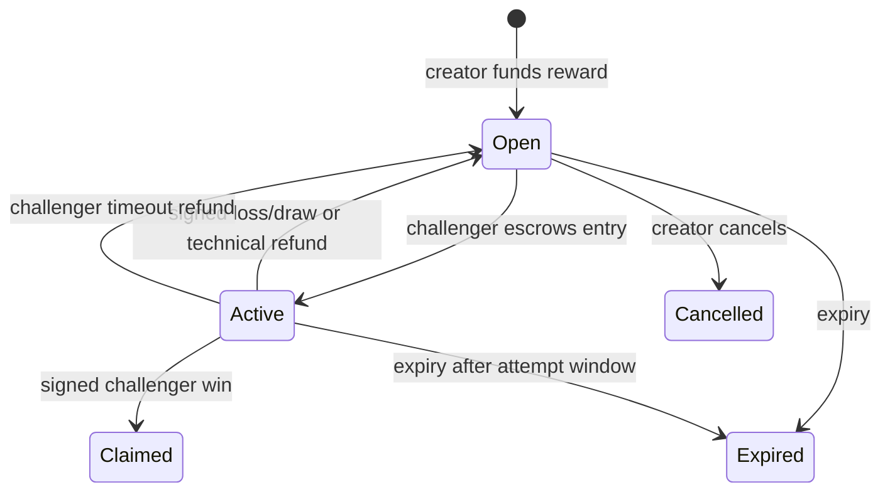

# War Machines bounty escrow

`contracts/src/WarMachineBountyEscrow.sol` is a standalone, non-upgradeable pathUSD escrow for paid War Machines bounties on Tempo mainnet. It is **not deployed yet**. A public deployment must not happen until the tests, bytecode, two independent settlement signers, pause guardian, user interface, backend attestation service, testnet rehearsal, and an independent Solidity review are complete.

## What the contract protects

- The contract, rather than the backend, holds every bounty reward and active entry.
- It accepts one configured TIP-20 token only at deployment. The included mainnet deploy script fixes this to Tempo pathUSD: `0x20C0000000000000000000000000000000000000`.
- The 2.5% reward fee and its recipient (`0xc20131e9132888993de6519D486E5558A5DbCb7A`) are immutable bytecode constants.
- The payout recipient is always the active challenger. A result signer cannot substitute a wallet, a fee rate, a token, a reward, or an entry amount.
- The creator receives the separately disclosed entry amount after a completed non-technical attempt. The platform receives no hidden entry fee.
- A creator cannot cancel while an attempt is active. A challenger can refund their entry after the attempt window if the result service is unavailable. Bounty expiry refunds both the reserve and any timed-out active entry.
- The pause guardian can stop new bounties and entries, but cannot block settlement, cancellation, expiry, or player refunds. There is no owner withdrawal, upgrade function, proxy, rescue method, or arbitrary transfer function.
- A battle outcome needs a fixed quorum of distinct EIP-712 signatures. The constructor permanently fixes the signer set and quorum. Use two independently controlled signers for a public release.
- Exact token balance checks reject fee-on-transfer or non-conforming token behavior. All value fields are integer token base units; pathUSD uses six decimals.

## What it does not prove

The on-chain contract cannot simulate the game. Settlement signers are an oracle for the off-chain deterministic replay. A quorum prevents one compromised signer from fabricating a result, but it does not make the oracle trustless. The complete replay must be published and its canonical hash must equal `resultHash` in the signed settlement. No administrator can reverse a settlement.

MPP `tempo.session` is a different escrow: a payment channel between an agent and a service payee. It is appropriate for repeated paid agent/API requests but cannot conditionally route a bounty reward to a challenger. Keep MPP session channels separate from bounty reserves.

## Contract lifecycle



The UI must show the gross reward, 2.5% fee, winner payout, entry amount, entry recipient, expiry, active-attempt deadline, token, chain, contract address, signer quorum, result hash, and every contract event before a wallet asks the user to sign or approve a transfer.

## Development checks

The package has no Solidity or npm dependencies. Foundry compiles the bundled sources directly.

```powershell
cd contracts
..\work\tooling\foundry\forge.exe fmt --check
..\work\tooling\foundry\forge.exe test -vvv
```

The tests cover payout accounting, fixed fees, loss/draw reserve retention, active-attempt cancellation protection, oracle timeout refunds, expiry refunds, invalid signatures, replay resistance, and pause powers.

## Mainnet deployment gate

Do not set Site paid-mode environment variables or take a payment until all of these are true:

1. Run the contract test suite and static analysis from a clean checkout.
2. Have an independent Solidity reviewer inspect the exact deployed bytecode and source.
3. Rehearse with two independent settlement keys, a dedicated pause guardian, expiry, cancellation, incorrect signatures, signer outage, wrong token, and wallet rejection.
4. Implement server-side EIP-712 result signing with separate keys and immutable result/replay hashing. The existing custodial payout queue must remain disabled until it is replaced.
5. Implement wallet contract calls for `approve`, `createBounty`, `enterBounty`, `settleAttempt` status reads, timeout refunds, and cancellation/expiry. MPP charge receipts cannot substitute for an on-chain bounty deposit.
6. Verify the deployed source at Tempo's contract verifier and publish the exact address in the site, `SKILL.md`, and API discovery.
7. Test first with a deliberately low real-money cap and no fee sponsorship. Paid-entry prize rules, tax, sanctions, consumer protection, and payment-provider requirements still need an operator review.

Tempo documents Foundry deployment and verification at <https://docs.tempo.xyz/sdk/foundry> and <https://docs.tempo.xyz/quickstart/verify-contracts>. Tempo mainnet is chain ID 4217 and pathUSD uses six decimals: <https://docs.tempo.xyz/protocol/exchange/pathUSD>.

## Interactive deployment only

Copy `contracts/deployments/tempo-mainnet.env.example`, enter public addresses only, and load it in the shell. The deployer must remain in a wallet or hardware-backed interactive signer; never paste a private key into this file, the shell history, the repository, ChatGPT Sites, or chat.

After testnet rehearsal and bytecode review, run the deployment script with the public values
loaded into the shell and Foundry's interactive key prompt:

```powershell
cd contracts
..\work\tooling\foundry\forge.exe script script/DeployWarMachineBountyEscrow.s.sol:DeployWarMachineBountyEscrow `
  --rpc-url https://rpc.tempo.xyz `
  --interactives 1 --broadcast --verify
```

That command needs the fully reviewed public signer, guardian, quorum and attempt-window values.
It deliberately asks for the deployer key interactively rather than accepting it from a file, so the
operator can inspect the destination, bytecode, chain, token, signer quorum, pause guardian, and
transaction before broadcast.

## Deploying with a browser Tempo wallet

An EVM-compatible Tempo wallet can deploy this contract without revealing its key to this
repository or to ChatGPT. Use this only after the mainnet deployment gate above has been met.

1. Connect the wallet to **Tempo Mainnet** (chain ID `4217`) and ensure it holds enough `pathUSD`
   to pay the transaction fee. Tempo has no native gas token; conventional wallet transactions to
   a contract need a `pathUSD` balance.
2. Open [Remix](https://remix.ethereum.org), create
   `WarMachineBountyEscrow.sol`, and paste the exact source from
   `contracts/src/WarMachineBountyEscrow.sol` at the reviewed Git commit.
3. In Remix Solidity Compiler select **0.8.30**, enable optimization with **1,000 runs**, and set
   EVM version to **Cancun**. Compile the `WarMachineBountyEscrow` contract.
4. In **Deploy & Run**, select **Injected Provider** and confirm the wallet shows Tempo Mainnet.
   Select `WarMachineBountyEscrow`, then enter these constructor arguments:

   ```text
   token:              0x20C0000000000000000000000000000000000000
   pauseGuardian:      <dedicated public guardian address>
   attemptWindow:      300
   settlementSigners:  [<signer 1 address>, <signer 2 address>]
   settlementQuorum:   2
   ```

   `signer 1` and `signer 2` must be independent, dedicated key holders. They are not allowed to
   change payout amounts or recipients, but both can attest a result. Do not use the deployer
   wallet as either signer or pause guardian.
5. Before approving the wallet popup, verify the chain, exact source commit, compiler settings,
   token address, guardian, both signer addresses, `300` second window, and `2` quorum. The fee
   recipient and 2.5% rate are compiled into the contract and cannot be changed during deployment.
6. Record the deployed address and transaction hash, verify it at
   [Tempo's contract verifier](https://contracts.tempo.xyz), then test only an extremely small
   bounty from a second wallet before enabling paid bounties in the Site.

Do not send `pathUSD` directly to the deployed address. The contract only accepts funds through
`createBounty` and `enterBounty`, after a wallet approves the exact token amount.

## Desktop Foundry launcher

`scripts/deploy-tempo-escrow.ps1` is prepared for a burner deployer. It only reads public
configuration values and asks Foundry for the burner key in the desktop terminal when
`-Broadcast` is explicitly supplied. The key is never written to the project or a Site setting.

```powershell
cd C:\Users\soubh\Documents\Codex\2026-09-12\hey\work\github-war-machine
.\scripts\deploy-tempo-escrow.ps1 -Initialize
```

Edit the created, ignored file at
`contracts/deployments/tempo-mainnet.local.env`: enter a dedicated pause guardian plus two
independently controlled settlement signer addresses. Then preview the immutable settings:

```powershell
.\scripts\deploy-tempo-escrow.ps1 -DeployerAddress <your burner address>
```

When the preview is correct, broadcast from the terminal:

```powershell
.\scripts\deploy-tempo-escrow.ps1 -DeployerAddress <your burner address> -Broadcast
```

The launcher first requires the literal confirmation `DEPLOY`, then Foundry prompts for the
burner key locally. Never paste that key into chat, a Site setting, `.env`, or a repository file.

If the burner is connected in a browser wallet whose private key cannot be exported, use the
same launcher with `-BrowserWallet` instead. Foundry will ask the browser wallet to sign; the
private key stays in that wallet.

```powershell
.\scripts\deploy-tempo-escrow.ps1 -DeployerAddress <your wallet address> -Broadcast -BrowserWallet
```

### Local encrypted Foundry deployer

Some Tempo browser or passkey accounts intentionally do not expose a raw private key. Do not try
to extract one. To use Foundry without a browser-wallet bridge, create a separate local encrypted
deployer instead:

```powershell
.\scripts\create-tempo-deployer.ps1
```

It stores a new key only as an encrypted keystore in `%LOCALAPPDATA%\WarMachines\deployer` and
prints its public address. Transfer a small pathUSD fee balance to that public address, then use
the same deployer with its keystore:

```powershell
.\scripts\deploy-tempo-escrow.ps1 `
  -DeployerAddress <printed public address> `
  -KeystorePath "$env:LOCALAPPDATA\WarMachines\deployer\war-machines-tempo-deployer" `
  -Broadcast
```

Foundry asks locally for the keystore password. Neither the password nor the raw key belongs in
chat, a Site environment setting, or the repository.

### Creating the two result signers

They are not funded wallets and do not pay transaction fees. They are two local, encrypted
keypairs whose **public** addresses are fixed into the escrow. A result needs both signatures, so
one leaked signing key cannot invent a payout.

Run this once in the desktop terminal after initializing the local configuration:

```powershell
.\scripts\create-escrow-result-signers.ps1
```

Foundry prompts locally for a different password for each key and saves encrypted keystores under
`%LOCALAPPDATA%\WarMachines\settlement-signers`. The script puts only their public addresses into
the ignored local deployment file. It also creates a third zero-balance keypair for
`WM_ESCROW_PAUSE_GUARDIAN`, so the only pre-existing wallet you need is the funded burner
deployer.

For a small private trial, both signer keypairs may be controlled by the same operator. That is
not independent protection against a compromised computer. Before public paid bounties, place the
signers under separate operational controls and build the result-attestation service that uses
them; the current Site deliberately does not hold these keys.
