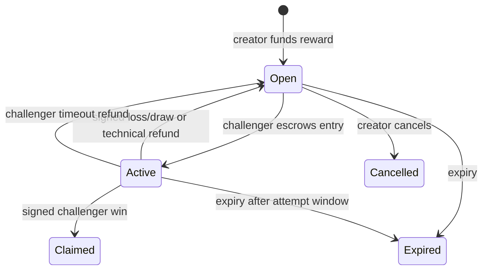

# War Machines bounty escrow

`contracts/src/WarMachineBountyEscrow.sol` is a standalone, non-upgradeable pathUSD escrow for paid War Machines bounties on Tempo mainnet. It is **not deployed yet**. A public deployment must not happen until the tests, bytecode, two independent settlement signers, pause guardian, user interface, backend attestation service, testnet rehearsal, and an independent Solidity review are complete.

## What the contract protects

- The contract, rather than the backend, holds every bounty reward and active entry.
- It accepts one configured TIP-20 token only at deployment. The included mainnet deploy script fixes this to Tempo pathUSD: `0x20C0000000000000000000000000000000000000`.
- The 2.5% reward fee and its recipient (`0xc20131e9132888993de6519D486E5558A5DbCb7A`) are immutable bytecode constants.
- The payout recipient is always the active challenger. A result signer cannot substitute a wallet, a fee rate, a token, a reward, or an entry amount.
- The creator receives the separately disclosed entry amount after a completed non-technical attempt. The platform receives no hidden entry fee.
- A creator cannot cancel while an attempt is active. A challenger can refund their entry after the attempt window if the result service is unavailable. Bounty expiry refunds both the reserve and any timed-out active entry.
- The pause guardian can stop new bounties and entries, but cannot block settlement, cancellation, expiry, or player refunds. There is no owner withdrawal, upgrade function, proxy, rescue method, or arbitrary transfer function.
- A battle outcome needs a fixed quorum of distinct EIP-712 signatures. The constructor permanently fixes the signer set and quorum. Use two independently controlled signers for a public release.
- Exact token balance checks reject fee-on-transfer or non-conforming token behavior. All value fields are integer token base units; pathUSD uses six decimals.

## What it does not prove

The on-chain contract cannot simulate the game. Settlement signers are an oracle for the off-chain deterministic replay. A quorum prevents one compromised signer from fabricating a result, but it does not make the oracle trustless. The complete replay must be published and its canonical hash must equal `resultHash` in the signed settlement. No administrator can reverse a settlement.

MPP `tempo.session` is a different escrow: a payment channel between an agent and a service payee. It is appropriate for repeated paid agent/API requests but cannot conditionally route a bounty reward to a challenger. Keep MPP session channels separate from bounty reserves.

## Contract lifecycle



The UI must show the gross reward, 2.5% fee, winner payout, entry amount, entry recipient, expiry, active-attempt deadline, token, chain, contract address, signer quorum, result hash, and every contract event before a wallet asks the user to sign or approve a transfer.

## Development checks

The package has no Solidity or npm dependencies. Foundry compiles the bundled sources directly.

```powershell
cd contracts
..\work\tooling\foundry\forge.exe fmt --check
..\work\tooling\foundry\forge.exe test -vvv
```

The tests cover payout accounting, fixed fees, loss/draw reserve retention, active-attempt cancellation protection, oracle timeout refunds, expiry refunds, invalid signatures, replay resistance, and pause powers.

## Mainnet deployment gate

Do not set Site paid-mode environment variables or take a payment until all of these are true:

1. Run the contract test suite and static analysis from a clean checkout.
2. Have an independent Solidity reviewer inspect the exact deployed bytecode and source.
3. Rehearse with two independent settlement keys, a dedicated pause guardian, expiry, cancellation, incorrect signatures, signer outage, wrong token, and wallet rejection.
4. Implement server-side EIP-712 result signing with separate keys and immutable result/replay hashing. The existing custodial payout queue must remain disabled until it is replaced.
5. Implement wallet contract calls for `approve`, `createBounty`, `enterBounty`, `settleAttempt` status reads, timeout refunds, and cancellation/expiry. MPP charge receipts cannot substitute for an on-chain bounty deposit.
6. Verify the deployed source at Tempo's contract verifier and publish the exact address in the site, `SKILL.md`, and API discovery.
7. Test first with a deliberately low real-money cap and no fee sponsorship. Paid-entry prize rules, tax, sanctions, consumer protection, and payment-provider requirements still need an operator review.

Tempo documents Foundry deployment and verification at <https://docs.tempo.xyz/sdk/foundry> and <https://docs.tempo.xyz/quickstart/verify-contracts>. Tempo mainnet is chain ID 4217 and pathUSD uses six decimals: <https://docs.tempo.xyz/protocol/exchange/pathUSD>.

## Interactive deployment only

Copy `contracts/deployments/tempo-mainnet.env.example`, enter public addresses only, and load it in the shell. The deployer must remain in a wallet or hardware-backed interactive signer; never paste a private key into this file, the shell history, the repository, ChatGPT Sites, or chat.

After testnet rehearsal and bytecode review, run the deployment script with the public values
loaded into the shell and Foundry's interactive key prompt:

```powershell
cd contracts
..\work\tooling\foundry\forge.exe script script/DeployWarMachineBountyEscrow.s.sol:DeployWarMachineBountyEscrow `
  --rpc-url https://rpc.tempo.xyz `
  --interactives 1 --broadcast --verify
```

That command needs the fully reviewed public signer, guardian, quorum and attempt-window values.
It deliberately asks for the deployer key interactively rather than accepting it from a file, so the
operator can inspect the destination, bytecode, chain, token, signer quorum, pause guardian, and
transaction before broadcast.
